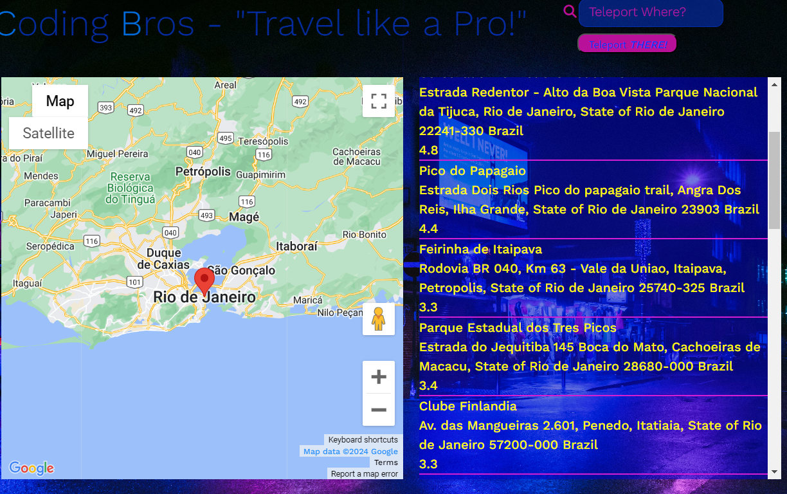

# Project 1 Team 4: Coding Bros Travel Planner
## Vini, Trevor, Jaden, & Michael - the Coding Bros
Coding Bros - "Travel Like a Pro!"

## Description

This program is a travel planner that allows the user to enter a city and receive a map, attractions, and create an itenerary for their trip.

It uses HTML, CSS, Javascript, jQuery, and multiple Third Party APIs.
In the production of this app we learned a lot about css animations and refined our knowledge of JQuery, objects, and localStorage.

[Link to deployed application](https://duleskyj.github.io/TravelAPI/)

## Usage

### Getting Started

Upon loading Coding Bros' Travel App, the user will be greeted with our group name, slogan, and a teleport button. Pressing the button will open a modal asking for user inputs. To continue the user must fill out empty input fields and click 'lets go'. 

### Pop-up Modal

If the user attempts to click 'lets go' without entering a city or date a pop-up will populate every time the button is pressed while the inputs remain empty. Should the user decide not to enter any information, they can press 'take me anywhere' to get a random location and today's itinerary. 

### Map

### Itinerary

If this is the first time the selected date has been used, it will generate an empty Itinerary. The user can enter the attractions they want to visit and at what times in hour increments. To change dates, simply click the 'change date' input box and select a new date from the datepicker and click 'load/reset'. !NOTICE! Pressing 'load/reset' will undo any unsaved changes to the itinerary. To save the itinerary press the button with the save icon(the top button). Once saved, the user can return to that date and the saved itinerary will persist.

